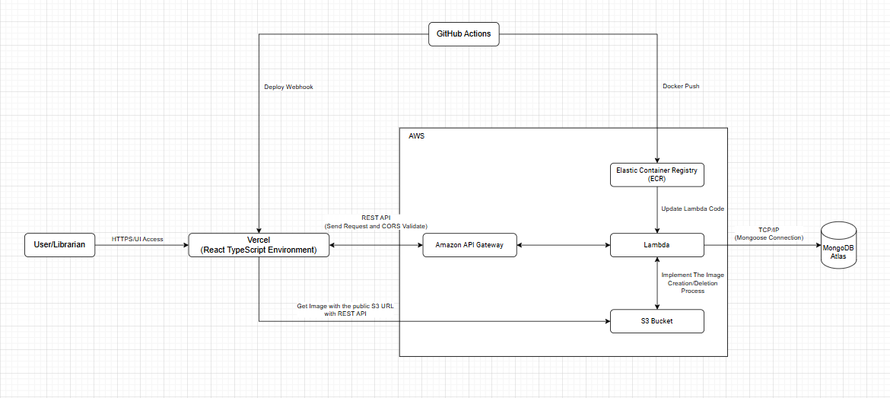
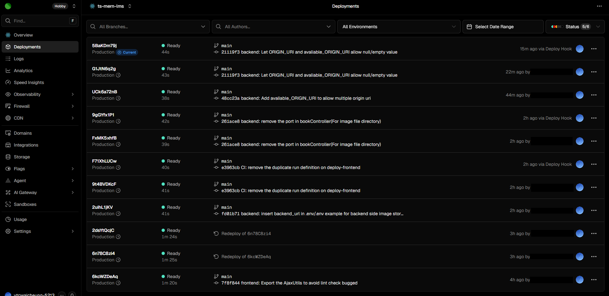
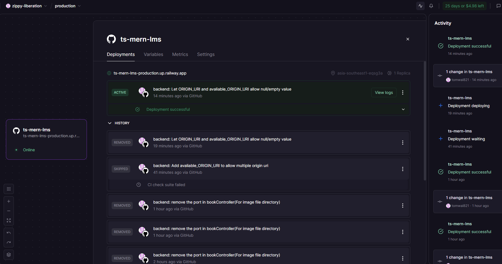
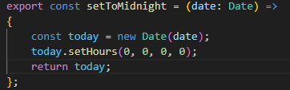
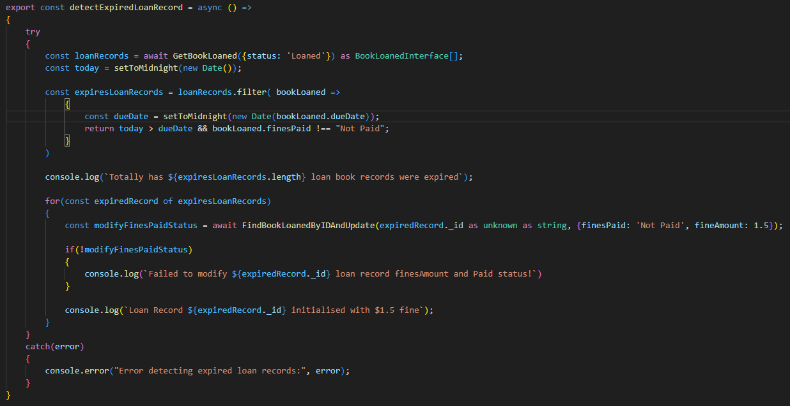
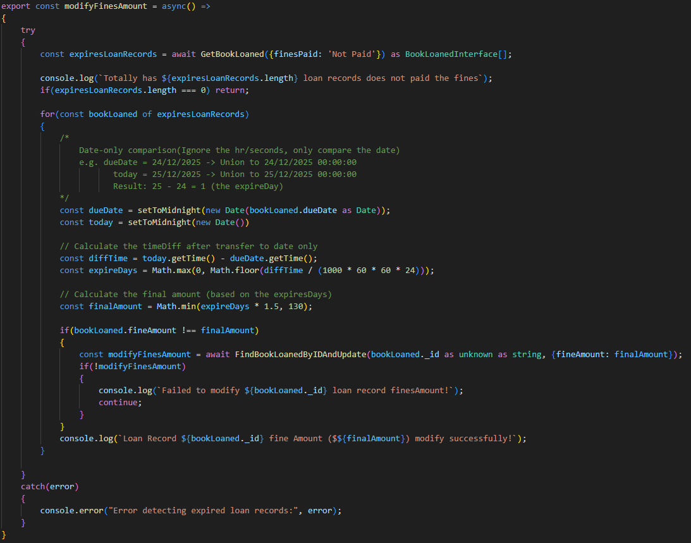
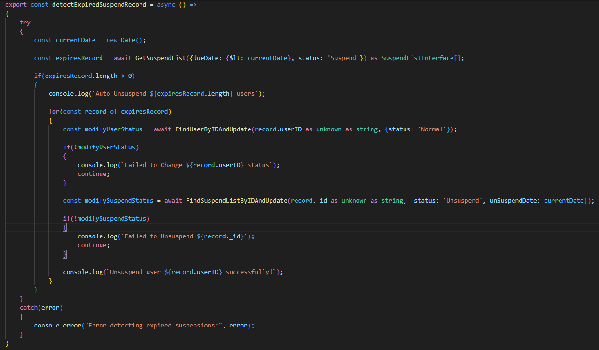

# MERN Library Management System


<br>
A full-stack application that streamlines library operations, built as an Information Technology Project (ITP)

## Video for presentation and demonstration
### SpeedRun version
- **[Features Speedrun Video](https://youtu.be/GU08EtdHS4I) (12 min):** A quick showcase of the system's core features for fast-paced viewing

### Detailed version
- **[Presentation Video](https://youtu.be/QuyYn-r9Nr4) (12 min):** An overview of the project concept, goals, and the inspiration behind it 
    
- **Demonstration Video (Total: 33 min):** A walkthrough of the project's features and live functionalities for each role<br>
    - [For Non-Librarian (Guest User and Authenticate User)](https://youtu.be/CtT22CMBoSo) - 15 min<br>
    - [For Librarian](https://youtu.be/ae6o5S0cZn0) - 18 min<br>

## Table of Contents
- [Introduction](#introduction)
- [Quick Start](#quick-start)
- [Technology Stack](#technology-stack)
- [Architecture](#architecture)
- [Features](#features)
- [Improvements](#improvements)
- [CI and CD](#ci-and-cd)
- [Testing Strategy](#testing-strategy)
- [Automated Logic Overview](#automated-logic-overview)
- [TF-IDF Logic Overview](#tf-idf-logic-overview)
- [UI Layout](#ui-layout)
- [QR Code Handling (Frontend Only)](#qr-code-handling-frontend-only)
- [Installation](#installation)
- [API endpoints](#api-endpoints)
- [Product Limitation](#product-limitation)
- [Contributing](#contributing)
- [License](#license)

## Introduction

### The Original Goal
Developed as an Information Technology Project (ITP) to modernise traditional library operations. The initial focus was on functional implementation: CRUD operations, QR Code integration, and a TF-IDF recommendation engine using the MERN stack

### The Engineering Evolution
After graduation, I dedicated myself to deep-diving into Software Engineering best practices, specifically focusing on maintainability and scalability, key enhancements include:
- **Architectural Overhaul**
    - Migrated to a Layered Architecture (Router-Middleware-Controller-Model) to ensure code decoupling and maintainability
      
- **Logic Refactoring**
    - Shifted core business logic (e.g., Recommendation Engine) from frontend-side processing to the Backend Service Layer to improve data reliability and system performance
      
- **DevOps Integration**
    - Implemented Docker containerisation and GitHub Actions (CI) for automated linting and integration testing


### Technical Learns 
- System Architecture - **Layered Design (Router-Middleware-Controller-Model)**
    - Designed a modular Express.js backend to achieve a clean Separation of Concerns
    - **Benefit**: Facilitates high code maintainability and allows independent testing of business logic and data access layers
  
- Atomic Data Management - **Reliable Image Persistence (Multer & fs/promises)**
    - Developed a custom upload workflow using memoryStorage to ensure Atomicity between DB records and physical files
    - **Action**: Implemented a Rollback mechanism and used Regex sanitisation to prevent redundant filename timestamps during consecutive edits
  
- Type-Safe Development - **End-to-End TypeScript Integration**
    - Leveraged TypeScript across the full stack to enforce rigorous data structures and interface contracts
    - **Result**: Significantly reduced runtime TypeErrors and improved developer productivity through IDE intelligent code completion
  
- Security Logic - **Dual-Token Authorisation & Identity Management**
    - Implemented stateless JWT authentication and a specialised Dual-Token verification workflow for high-risk transactions
    - **Usage**: Enforces a "Four-Eyes Principle" for book loaning, requiring concurrent valid tokens from both the Borrower and the Authorised Personnel
  
- State Orchestration - **Performance-Oriented Frontend Architecture**
    - Optimised React performance by centralising global state with Context API and encapsulated logic within Custom Hooks
    - **Benefit**: Minimised unnecessary component re-renders and established a predictable, one-way data flow
      
- Automated QA & DevOps - **CI/CD Pipeline & Containerisation**
    - Built a robust DevOps pipeline using Docker and GitHub Actions to automate the development lifecycle
    - **Standard**: Enforces strict Linting and Integration Testing via Supertest/Jest before any code is deployed to the repository


### Disclaimer
All contact information provided in this file is fictitious and used solely for demonstration purposes


## Quick Start
### 1. Copy example environment variables and edit
```bash
cp backend/.env.example backend/.env
cp frontend/.env.example frontend/.env
```
- Edit backend/.env: set at minimum: MONGO_URI, JWT_SECRET, PORT, ORIGIN_URI, GOOGLE_BOOKS_API_KEY, GOOGLE_BOOKS_BASE_URL, BACKEND_BASE_URL
- Edit frontend/.env: set at minimum: REACT_APP_API_URL, REACT_APP_MAIN_PAGE

**Notes about ports and hostnames** 
- If you run the project with **Docker Compose**, use the Docker examples in `.env.example` (e.g. `MONGO_URI=mongodb://mongo:27017/...`). Docker Compose maps container ports to the host automatically
- If you run services locally (not via Docker), replace container hostnames with `localhost` and ensure `PORT` matches the port you start the backend on (e.g. `3000`)
- Always include protocol and port for URLs: `ORIGIN_URI=http://localhost:5000`, `REACT_APP_API_URL=http://localhost:5000/api`, `REACT_APP_MAIN_PAGE=http://localhost:3000`, `BACKEND_BASE_URL=http://localhost:5000`

### 2. Launch with Docker Compose
```bash
docker-compose -f compose.yaml up --build -d
```


## Technology Stack
- **Frontend:** React, Material-UI for styling(Leveraging CSS3 Standard), integrated react-router-dom for SPA(Single Page Application) navigation
- **Backend:** Node.js, Express.js
- **Database:** MongoDB with Mongoose (With Nodemon for development)
- **Image Data Handling:** Multer for file uploads
- **Data security:** JWT(JSON web token) for Authentication, Bcrypt for password hashing
- **Environment Configuration:** dotenv for managing environment variables
- **Algorithms:** TF‑IDF for recommendation engine
- **CI/CD & Code quality:** GitHub Actions for CI/CD, Jest for ing, ESLint for linting
- **Other**: RESTful APIs with modular design, Docker for containerisation and environment consistency


## Architecture


### System Architecture Overview
***Architecture Diagram - Development***
<br>
1. **Development & Deployment Environment**
- In the development phase, the system is fully containerised to ensure "it works on my machine" consistency
    - **Infrastructure**: Orchestrated via Docker Compose
    - **Networking**: Services communicate within a Docker Virtual Network
    - **Persistence**: Local MongoDB container with Docker Volumes for data retention
    - **Configuration**: Managed via local .env files
          
2. **Backend Layered Architecture**
- The backend follows a Modular Layered Architecture to achieve Separation of Concerns (SoC) and ensure system scalability

| Layer            | Responsibility	                                                   | Key Practice                                 |
| ---------------- | ----------------------------------------------------------------- | -------------------------------------------- |
| Routing          | Resource-based dispatching (e.g., /books, /users)                 | Decoupled Modules using express.Router       |
| Middleware       | Handles Auth (JWT), Validation, and Integrity checks              | The Quality Gate for incoming data           |
| Controller       | Orchestrates business logic and service interactions              | Hybrid Layer (Integrated Service Logic)      |
| Service Logic    | Core Algorithms (TF-IDF) and Business Operations                  | Encapsulated Functions called by Controller  |
| Model (DB)	   | Schema definitions and Persistent Storage logic	               | Data Integrity via Mongoose static methods   |

***View Architectural Decision (Service Logic Integration)***
- To maintain high development velocity and facilitate rapid iteration during the initial MVP phase, the business logic is currently encapsulated within the Controller Layer as a Hybrid Patter
- However, as illustrated in the Request Lifecycle Diagram, the core logic (such as the TF-IDF Recommendation Engine and Data Validation) is designed with modularity in mind
- These functions are logically separated and ready to be fully decoupled into a dedicated Service Layer to enhance Unit Testability and Separation of Concerns (SoC) as the system scales


***Architecture Diagram - CD (Continuous Deployment)***<br>
<br>

- The production stack leverages managed PaaS/SaaS for high availability and performance
    - **Frontend**: Hosted on Vercel for optimised edge delivery
    - **Backend**: Running on Railway with auto-scaling Node.js runtime
    - **Database**: MongoDB Atlas (DBaaS) for managed security and global scaling
    - **Security**: Secrets are injected via Platform UIs (Vercel/Railway), keeping credentials out of the source code

### Core Concept for the whole Architecture
- Regardless of the environment (Local or Production), the core application logic remains consistent and follows a unified quality standard:
    - **Modular Backend**: Follows the Route-Middleware-Controller pattern with Mongoose for data access
    - **CI/CD Pipeline**: GitHub Actions serves as the central orchestrator:
        - **Automation**: Triggers **Deploy Hooks (HTTP POST)** to **Vercel** to initiate automated frontend builds and deployments
        - **Data Sync**: Interacts with the **Backend (Railway)** via **GraphQL Mutations** to automate data synchronisation or administrative tasks
        - **Quality Gate**: Ensures code reliability through automated testing and linting before any deployment

### Frontend
***Sequence Diagram (Authentication)***
    
1. Registration<br>
<br>
- This sequence diagram illustrates the modular backend registration flow — from frontend validation and request dispatch, to database interaction and token generation<br>
  (It ensures secure account creation with robust error handling and clean separation of concerns across services)<br>
       
2. Login<br>
<br>
- This sequence diagram illustrates the login flow across frontend and backend layers — from validation and request dispatch to database verification and token generation<br>
  (It ensures secure authentication with proper error handling and modular separation across components such as middleware, endpoint logic, and MongoDB integration)<br>
    
***Sequence Diagram (Project Features)***
1. External Data from Google Book API
<br>
- This sequence diagram illustrates the book data retrieval flow initiated by a frontend GET request to the Google Books API
- When the user presses the book image, an event handler constructs and sends a request containing the book name and author name
- The event handler processes the returned data and renders the book results to the user interface (When receive the response)
    
2. QR Code Generation<br>
<br>
- This sequence diagram illustrates the QR Code generation flow initiated by a user interaction
- When the user clicks the "Display QR Code" button, the event handler retrieves the authentication token and username from local or cookie storage
- Then parses the data and sends a request to the QR Code Generator service
- The event handler opens a modal and displays the generated QR code to the user (When receive the response)

    
***Sequence Diagram (CRUD operations)***
1. Get data from backend side<br>
<br>
- This sequence diagram illustrates the data retrieval flow initiated via a frontend GET request
- The process involves middleware-level parsing, backend token validation, and data querying from MongoDB
- With modular orchestration across services and structured response handling, it ensures secure and reliable delivery of data to the client<br>
    
    
2. Data Creation
<br>
- This sequence diagram illustrates the user confirmation flow, beginning with a frontend POST request and progressing through middleware parsing, backend validation, and MongoDB record creation
- It demonstrates secure data handling with token verification, modular backend orchestration, and structured client response<br>
  (It ensure reliability and clarity in the user confirmation process)<br>
    
    
3. Data Modification
<br>
- This sequence diagram illustrates the confirmation flow via a frontend PUT request<Br>
  (Whowing how user-modified data is securely validated, parsed, and updated in the backend)<br>
- The system ensures accurate record updates and clear client feedback with middleware safeguards, token verification, and modular backend orchestration
    
    
4. Data Deletion
<br>
- This sequence diagram captures the user confirmation flow initiated via a frontend DELETE request
- The process includes middleware-level data parsing, backend token validation, and MongoDB record deletion<br>
  (It ensures secure and reliable user operations yhrough structured response handling and modular orchestration across services)<br>

5. Get Data From Google Book (API Integration)
<br>
- The application uses a Node.js middleware to bridge the React frontend with the Google Books API<br>
  (When a user searches for a book, the backend first validates the user's Auth Token for security)<br>
- After fetching the raw data from the external API, the backend filters and refines the response into a clean payload<br>
  (This approach optimises performance, enhances data security and ensure the frontend only receives the necessary information for UI rendering)<br>


### Backend

***Backend Process Flow Diagram and another function***<br>
<br>
Backend side using modular API design, therefore using backend process flow diagram is better than using a class diagram to explain the backend architecture
| Component           | Usage                                                                                                  | Example Path (Backend - Book data)                                                              |
| ------------------- | ------------------------------------------------------------------------------------------------------ | ----------------------------------------------------------------------------------------------- |
| Client / Request    | Initiates API calls via Fetch from the frontend	                                                       | frontend/src/Controller/bookController.ts                                                       |
| Entry Point         | Initialises the Express server and mounts core middleware                                              | backend/src/index.ts                                                                            |
| Router              | Orchestrates resource-based routing modules                                                            | backend/src/routes/book.ts                                                                      |
| Validator           | Enforces Schema Validation (Request Body) before processing                                            | backend/src/validator/expressBodyValidator.ts                                                   |
| Auth Middleware     | Handles Identity & Access Control (JWT)                                                                | backend/src/controller/middleware/authMiddleware.ts                                             |
| Business Middleware | Performs Integrity Checks (e.g. verifying DB record existence)                                         | backend/src/controller/middleware/Book/bookValidationMiddleware.ts                              |
| Controller          | Orchestrates request parsing, service logic, and DB interactions                                       | backend/src/controller/bookController.ts                                                        |
| TF-IDF Engine	      | Core Algorithm Service for search and recommendations                                                  | backend/src/controller/TF-IDF_Logic.ts                                                          |
| Image Handler       | Manages atomic file storage (memoryStorage), filename sanitization (Regex), and disk I/O (fs/promises) | backend/src/controller/middleware/HandleEditImage.ts, backend/src/controller/bookController.ts  |
| Data Access (Model) | Defines Mongoose Schemas and manages Persistent Storage	                                               | backend/src/schema/book/book.ts                                                                 |
| API Response	      | Standardises and returns the final JSON response to the client	                                       | backend/src/controller/bookController.ts                                                        |

**Remarks**
- Controllers in this repo perform business logic (act like the service) and send the final HTTP response at the end of the handler using res.status(...).json(...)
- Helper functions may return values for unit tests, but controllers must call res in runtime

Other functions (grouped, not on main synchronous path)
| Function                   | Usage                                                                                                       | Example Path                                                 |
| -------------------------- | ----------------------------------------------------------------------------------------------------------- | ------------------------------------------------------------ |
| CI Pipeline (Quality Gate) | Automated Linting and Unit/Integration Testing on every mon-documentation Push/PR                           | .github/workflows/ci.yml,  .github/workflows/cd.yml          |
| Infrastructure/Init        | Container orchestration and automated DB Schema initialization / Seeding for environment parity             | docker-compose.yml/compose.yaml, backend/MongoDBSchema/*     |
| Scheduled Jobs             | Background services for critical business logic (e.g., overdue detection and automated fine calculation)    | backend/detectRecord.ts                                      |


### Database

***Entity-Relational Diagram(ERD)***<br>
<br>
This ERD explain the database schema for the Library Management System


****Collections related to book data****<br>
Book
| Key Attribute | Type     | Enum                  | Required | Default   | Description                                                              |
| ------------- | ---------| --------------------- | -------- | --------- | ------------------------------------------------------------------------ |
| image         | Object   |                       |          |           | Stores book cover image details, including URL and filename              |
| bookname	    | String   |                       | True     |           | The title of the book for identification                                 |
| languageID    | ObjectID |                       | True     |           | References for the Language collection, indicating the book's language   |
| genreID       | ObjectID |                       | True     |           | References the Genre collection, categorising the book                   |
| authorID      | ObjectID |                       | True     |           | Links to the Author collection, storing authorship details               |
| publisherID   | ObjectID |                       | True     |           | Assoates with the publisher collection for book publishing details     |
| status        | String   | ['OnShelf', 'OnLoan'] | True     | 'OnShelf' | Defines the book’s availability, such as OnShelf and Loaned              |
| description   | String   |                       |          | 'N/A'     | Provides a brief overview or synopsis of the book                        |
| publishDate   | Date     |                       |          |  Date.now | The offial publication date of the book, indexed for search effiency |

Genre
| Key Attribute | Type   | Required  | Unique | Description                                                                   |
| ------------- | ------ | --------- | ------ | ------------------------------------------------------------------------------|
| genre         | String | True      | True   | The full name is used to represent the genre, ensuring correct classification |
| shortName     | String | True      | True   | An abbreviated version of the genre name is used for display purposes         |

Language
| Key Attribute | Type   | Required  | Unique | Description                                                                   |
| ------------- | ------ | --------- | ------ | ----------------------------------------------------------------------------- |
| language      | String | True      | True   | The full name used to represent the language, ensures correct classification  |
| shortName     | String | True      | True   | An abbreviated version of the language name is used for display purposes      |

Author
| Key Attribute | Type   | Required  | Unique | Default | Description                                                                              |
| ------------- | ------ | --------- | ------ | ------- |----------------------------------------------------------------------------------------- |
| author	    | String | True      | True   |         | The full name of the author, stored for identification purposes                          |
| phoneNumber	| String |           |        | 'N/A'   | The contact number provided for communication with the author                            |
| email         | String |           |        | 'N/A'   | The email address used for professional or system-related correspondence with the author |

Publisher
| Key Attribute |  Type  | Required | Unique | Default | Description                                                                                 |
| ------------- | ------ | -------- | ------ | ------- | ------------------------------------------------------------------------------------------- |
| publisher	    | String | True     | True   |         | The full name of the publisher, stored for identification purposes                          |
| phoneNumber   | String |          |        | 'N/A'   | The contact number provided for communication with the publisher                            |
| email         | String |          |        | 'N/A'   | The email address used for professional or system-related correspondence with the publisher |


****Collections related to user data****<br>
User
| Key Attribute | Type    | Enum                  | Required | Unique | Default  | Description                                   |
| ------------- | ------- | --------------------- | -------- | ------ | -------- | --------------------------------------------- |
| Username      | String  |                       | True     | True   |          | The unique display name chosen by the user    |
| Email         | String  |                       | True     | True   |          | Primary identifier for authentication         |
| Password      | String  |                       | True     |        |          | Encrypted storage for login credentials       |
| Gender        | String  |                       | True     |        |          | Captures gender identity for the user profile |
| Role          | String  | ['User', 'Admin']     | True     |        | 'User'   | Defines permissions for admin and user        |
| Status        | String  | ['Normal', 'Suspend'] | True     |        | 'Normal' | Describe the account status                   |
| birthDay      | Date    |                       | True     |        |          | Stores the user’s date of birth               |
| avatarurl     | String  |                       | True     |        |          | The URL for the avatar image                  |

SuspendList
| Key Attribute |	Type    | Enum                     | Required | Default            | Description                                                                                                |
| ------------- | --------- | ------------------------ | -------- | ------------------ | -----------------------------------------------------------------------------------------------------------|
| userID        | ObjectID  |                          |          |                    | Links to the user collection, ensuring proper tracking of suspended individuals                            |
| description	| String	|                          |          | 'N/A'              | Stores details about the reason for the user's suspension, ensuring proper enforcement of library polies |
| Status        | String    | ['Suspend', 'Unsuspend'] | True     | 'Suspend'          | Describe the account status, such as Normal, Suspend                                                       |
| startDate	    | Date	    |                          |          |                    | The date when the user suspension begins                                                                   |
| dueDate	    | Date	    |                          |          |                    | The scheduled date when the suspension will end, allowing access restoration                               |


****Collections related to interaction between book and user****<br>
BookLoaned
| Key Attribute | Type     | Enum                                     | Required | default           | Description                                                                                          |
| ------------- | -------- | ---------------------------------------- | -------- | ----------------- | ---------------------------------------------------------------------------------------------------- |
| userID        | ObjectID |                                          | True     |                   | References the User collection                                                                       |
| bookID        | ObjectID |                                          | True     |                   | References the Book collection                                                                       |
| loanDate      | Date     |                                          | True     |                   | The date when the user loaned the book                                                               |
| dueDate       | Date     |                                          | True     |                   | The date on which the book should return                                                             |
| returnDate    | Date	   |                                          |          | null              | The actual date when the book returns                                                                |
| Status	    | String   | ['Returned', 'Loaned', 'Returned(Late)'] |          | 'Loaned'          | Defines the loan status, such as Loaned, Returned                                                    |
| finesAmount   | Number   |                                          |          | 0                 | The monetary fine for overdue book returns                                                           |
| finesPaid	    | String   | ['Not Fine Needed', 'Paid', 'Not Paid']  |          | 'Not Fine Needed' | Indicate whether the fine was paid, with predefined statuses, like Paid, Not Paid, or No Fine Needed |

BookFavourite
| Key Attribute | Type     | Required | Description                                                                  |
| ------------- | -------- | -------- | ---------------------------------------------------------------------------- |
| userID        | ObjectID | True     | References the User collection, identifying the user who favourited the book |
| bookID        | ObjectID | True     | References the Book collection, identifying the book marked as favourite     |

Remarks:
1. Every collection includes an _id field of type ObjectId, which serves as the unique identifier


## Features 
- **Intelligent Recommendation**
    - Developed a custom TF-IDF engine to provide data-driven book recommendations based on user history, enhancing personalised content discovery
      
- **External Data Enrichment**
    - Integrated Google Books API on the client side to fetch and display extended metadata, providing a rich user experience without bloating the backend database
      
- **Automated Loan Tracking**
    - Built an automated tracking system for loaned books and return statuses, ensuring real-time data consistency and operational visibility
      
- **QR-based Operations**
    - Streamlined book loaning via QR Code integration, implementing a multi-token exchange protocol to facilitate identity verification and transaction authorization between the borrower and the librarian
      
- **Security Architecture**
    - Implemented JWT-based Authentication with Bcrypt hashing, utilizing Frontend Route Guards and Role-aware UI rendering for access control


## Improvements

### Completed

#### Frontend Side
1. **Response-Driven API Service (frontend side)**
    - Refactored legacy API wrappers to return full HTTP Response objects, enabling granular error handling and dynamic UI state management based on status code
  
2. **I/O Concurrency & Fault Tolerance (Promise.allSettled)**
    - Implemented concurrent API fetching using Promise.allSettled to parallelise independent data requests<br>
      (This ensures UI resilience, allowing the dashboard to render partially even if individual microservices or endpoints fail)

#### Backend Side
1. **Modularised backend routes for cleaner structure**
    - Decoupled monolithic routes into modularised controllers, implementing Middleware for centralised authentication and validation to ensure DRY (Don't Repeat Yourself) principles

2. **Automated Library Compliance & Fine Processing**
    - Engineered a custom task scheduler to automate mission-critical daily operations (Expired Loans, Fines Calculation, Suspend Records) at UTC+8 midnight

3. **Performance Optimisation (Promise.all)**
    - Optimised multi-field database validations by refactoring sequential lookups into concurrent operations via Promise.all<br>
      (This significantly reduced API response latency by processing independent I/O tasks in parallel)
  
#### Infrastructure and Security
1. **Multi-Environment Containerization (Docker)**
    - Implemented Dockerization with dedicated configurations for different stages<br>
      (docker-compose.yaml for production-ready consistency and docker-compose.test.yaml for automated testing workflows)<br>

2. **Standardised Development Lifecycle**
   - Ensures seamless parity across development, testing, and deployment, eliminating "it works on my machine" issues
    
3. **Modular Workspace & Dependency Isolation**
    - Architected a -style structure by separating Frontend and Backend into independent directories with isolated package.json and node_modules<br>
      (It improved CI/CD pipeline efficiency and prevented dependency conflicts, ensuring a cleaner and more scalable development workflow)<br>

4. **Secure Configuration Management (dotenv)**
   - Implemented Environment Variable management using dotenv to decouple sensitive configuration from the source code<br>
     (It enhanced system security by protecting API keys, Database URIs, and JWT secrets, facilitating seamless transitions between development and production environments)

#### CI/CD
1. **Automated CI/CD Pipeline (GitHub Actions)**
   - Automatically triggers Jest suites and ESLint on every Push and Pull Request<br>
     (Serves as a CI quality gate to prevent regression and enforce unified coding standards across the full-stack codebase)

2. **Resource & Cost Optimisation**
   - Controlled deployment triggers to minimise redundant builds and optimise cloud credit consumption<br>
    (Utilised Ignored Build Step and manual API triggers to manage resource usage efficiently across different cloud platforms)
     
3. **Cloud Database & Secret Orchestration**
   - Integrated MongoDB Atlas and managed sensitive credentials via Platform Environment Variables<br>
     (It decoupled the database layer from the application logic and secured production secrets like JWT and Database URIs outside the source code)


### Planned Improvements

#### Frontend Side
1. **Apply custom hooks to centralise commonly used state**
    - Reduce redundant state creation in view components (Ref: `./frontend/src/customhook.tsx`)
    
2. **Refactor Context API into two specialised hooks**
    - One for data state and another for CRUD operations to improve maintainability and decouple view logic
  
3. **Optimised Modal Data Handling**
    - Pass index numbers instead of entire data objects to modals; use a getter function via Context to retrieve data, improving performance and readability
    
4. **Bulk Input Support**
    - Support multiple contact (Publisher/Author) inputs via JSON strings to enhance efficiency over manual field entry

5. **Unified API Transport Layer (Ajax Utils)**
    - Centralised API communication into a generic transport layer (Ref: `./frontend/src/improvement/AjaxUtils`)<br>
      (This standardises request/response formats and error-handling protocols, significantly decoupling business logic from the underlying fetch implementation)


#### Backend Side
1. **Server-side RBAC (Role-Based Access Control)**
    - Implement server-side role validation for all API requests to ensure data integrity (currently handled on the frontend for demo scope)
  
2. **Production-Grade Task Scheduling**
    - Replace basic `setInterval` + `setTimeout` with **node-cron** or cloud-based schedulers for better reliability and error handling
    
3. **Standardised Response Wrapper**
    - Implement a unified response structure (e.g., `errorCode`, `errorMessage`, `totalCount`) to improve API usability (Ref: `./backend/src/improvement/`)
    
4. **Generic CRUD Factory (OOP & Factory Pattern)**
    - Implemented a Generic CRUD Factory to encapsulate redundant DB operations across collections (Ref: `./backend/src/improvement/CRUDFactory.ts`)

5. **ACID Transactions (Multi-collection Consistency)**
    - Transitioning complex Write/Delete operations from **Promise.all** to **MongoDB Transactions** to ensure strict atomicity across related collections (e.g., cascading deletes) in production replica-set environments


#### Infrastructure and Security
1. **Container Granularity**
   - Migrating from a unified container to a fully decoupled micro-service architecture, separating Frontend (Nginx), Backend (Node.js), and Database (MongoDB) into isolated, dedicated containers

2. **Scalability & Networking**
   - Implementing a private Docker network for secure inter-service communication, allowing independent scaling of the API and Web layers to optimise resource allocation
     
3. **Hardware Integration**
    - Add direct **HID (Human Interface Device)** support for seamless scanner gun synchronisation
      
4. **Secure QR Code via Redis & UUID**
    - Map sessions to short-lived UUIDs in **Redis** with **TTL** to prevent `authToken` exposure and token reuse
    
5. **HttpOnly Server-side Cookies**
    - Migrate `authToken` storage to **HttpOnly Cookies** to mitigate **XSS (Cross-Site Scripting)** risks by preventing client-side script access

#### CI/CD
1. **Enterprise Cloud Migration (AWS/Azure)**
    - Transitioning from PaaS (Railway/Vercel) to IaaS/FaaS (e.g., AWS EC2/Lambda or Azure App Service)<br>
      (It provides granular control over server resources and networking configurations for production-scale traffic)

2. **Comprehensive Test Coverage (Jest)**
    - Expanding the testing suite to include Edge Case Validation and Boundary Testing across all API endpoints<br>
      (It aims to achieve 80%+ code coverage, ensuring high system resilience against unexpected user inputs and invalid payloads)

3. **Automated System Testing (E2E)**
    - Implementing End-to-End (E2E) / System Testing to simulate real-world user journeys from Frontend to Database<br>
      (It provides a higher dimension of verification beyond isolated units, ensuring the entire integrated stack functions correctly as a single system)

## CI and CD

### Continuous Integration (CI)
- **Automated Pipeline**
    - Orchestrated with GitHub Actions to trigger on every Push and Pull Request.
- **Quality Assurance**
    - **Frontend**: Executes Unit Testing with Jest to ensure UI logic reliability
    - **Backend**: Performs Integration Testing to validate full API request-response cycles and database interactions
- **Linting**
    - Enforces code consistency via ESLint across the entire stack
- **Artefact Management**
    - Automatically generates and uploads backend Test Coverage Reports as CI artefacts for reviewer visibility
- **Docker Integration**
    - Automates Docker Image builds within the pipeline to ensure cross-environment reproducibility


### Continuous Deployment (CD)
- **Multi-Platform Deployment Strategy**
    - **Frontend (Vercel)**
        - **Orchestrated Deployment**
            - Replaced default auto-update with Vercel Deploy Hooks triggered via GitHub Actions
      
        - **Resource Optimisation**
            - Implemented Ignored Build Step to prevent redundant builds and ensure the frontend only updates after the backend service is confirmed ready
        
    - **Backend (Railway)**
        - **Fine-grained Control**
            - Triggered manually via Railway GraphQL API (environmentTriggersDeploy) to precisely manage deployment timing and optimise resource usage (Credit consumption)
        
    - **Database (MongoDB Atlas)**
        - **DBaaS Integration**
            - Integrated a cloud-managed Database-as-a-Service (DBaaS) layer (Connection strings are securely injected via Railway's environment variables to ensure data persistence across container redeployments)

- **Deployment Status and Records**
    - **Images**<br>
    <br>
    Image 1 - Vercel Deployment Record<br>
    <br>
    Image 2 - Railway Deployment Record<br>

- **Changes**
    - **Production Environment Realignment**
        - Migrated BACKEND_BASE_URL and BASE_URL from localhost to platform-specific production endpoints (Vercel/Railway)<br>
               (It ensured seamless communication between the decoupled frontend and backend services in a live cloud environment)<br>
          
    - **Security & CORS Optimisation**
        - Enhanced the ORIGINAL_URI configuration to support Multiple Origins<br>
          (It allowed the backend to securely accept requests from both the Vercel production domain and local development environments simultaneously, improving workflow flexibility without compromising security)


### Remarks
- The entire CI/CD workflow is managed and automated via GitHub Actions workflows
- CI/CD workflow definitions are located in `.github/workflows/` (The whole process could be viewed in the actions tab -> All workflows, CD workflow = CD pipeline)
- Backend CD are utilising Railway’s $5 credit/30 days trial/subscription model for consistent backend uptime


## Testing Strategy

### Overview
- **Frontend:** Unit tests with Jest + React Testing Library (mock APIs, setup/teardown hooks)  
- **Backend:** Integration tests with Jest + Supertest (real DB operations tested in CI pipeline)
- **Result:** CI pipeline runs tests automatically on push/PR, logs kept clean for recruiter/demo clarity

#### 1. Docker test compose (Jest)
- Build test containers
  ```bash
  docker compose -f compose.test.yaml build
  ```
- Start test environment
  ```bash
  docker-compose -f docker-compose.test.yml up
  ```
- Run Jest tests inside container  
  ```bash
  docker exec backend npm test
  ```

#### 2. Local test (Jest)
1. Start local server
   - For backend side
   ```bash
   npm run dev
   ```
   - For frontend side:
   ```bash
   npm run start
   ``` 
2. Run tests locally  
   ```bash
   npm run test
   ```

### Test cases

THe following test case are using docker test compose (Jest)

#### Frontend
   
1. Register an account (In Register Page)
    - Expectation
        - Alert is shown with success colour (green)
        - Alert message is 'Registration successful! Redirecting...'
    - Result
        - Same as expectation

2. Input the already registered data (In Register Page)
    - Expectation
        - Alert is shown with error colour (red)
        - Alert message is 'Failed to register! Please try again'
    - Result
        - Same as expectation
   
3. Input DOB that is younger than 6 years old (In Register Page)
    - Expectation
        - HelperText is shown
        - HelperText message is 'Only users aged 6 years and older can register'
    - Result
        - Same as expectation
   
5. Login account (In Login Page)
    - Expectation
        - Alert is shown with success colour (green)
        - Alert message is 'Login successfully'
    - Result
        - Same as expectation
   
6. Input an invalid password (In the login page)
    - Expectation
        - Alert is shown with error colour (red)
        - Alert message is 'Invalid email or password!'
    - Result
        - Same as expectation

7. Let the email input field become empty (In the login page)
    - Expectation
        - HelperText is shown
        - HelperText message is 'Please enter a valid email address'
    - Result
        - Same as expectation
   
8. Let the password input field become empty (In the login page)
    - Expectation
        - HelperText is shown
        - HelperText message is 'password must be at least 6 characters long'
    - Result
        - Same as expectation


****Remarks****
- This is unit test
- Frontend test case in './frontend/src/__test__/Login.test.tsx'
- It will remove session storage and cookie storage data after completing each test case


****Test Coverage****
- Current Coverage: ~41.78%
- Coverage report integrated into CI workflow (viewable in GitHub Actions tab, last CI run)
- Focus on core process (Authentication, profile data, book data filtering)


#### Backend

***For User Data***
1. Account Registeration
    - Expectation:
        - Status Code 200
    - Result
        - Same as expectation

2. Account Registeration (with already registeration data)
    - Expectation
        - Status Code 400
        - error message should be 'Email already in use'
    - Result
        - Same as expectation

3. Account Login
    - Expectation
        - Status Code 200
        - message should be 'Login Successfully!'
    - Result
        - Same as expectation

4. Account Login (With Invalid email)
    - Expectation
        - Status Code 400
        - message should be 'Invalid email address'
    - Result
        - Same as expectation

5. Account Login (With Invalid password)
    - Expectation
        - Status Code 400
        - message should be 'Invalid password'
    - Result
        - Same as expectation

6. Get User Profile data
    - Expectation
        - Status Code 200
        - It should return an object which include username, gender, role in data column
    - Result
        - Same as expectation

7. Get User Profile data (With Invalid JWT Token)
    - Expectation
        - Status Code 401
    - Result
        - Same as expectation

8. Get User Loan Book Record
    - Expectation
        - Status Code 200
        - It should return [] (It is new account)
    - Result
        - Same as expectation

9. Get User Favourite Book Record
    - Expectation
        - Status Code 200
        - It should return [] (It is new account)
    - Result
        - Same as expectation

***For Book Data***
1. Get the whole book data
    - Expectation
        - Status Code 200
    - Result
        - Same as expectation

2. Get the whole book data with filter data (bookname=Harry)
    - Expectation
        - Status Code 200
    - Result
        - Same as expectation

3. Get the whole book data with invalid filter data (bookname=zzz)
    - Expectation:
        - Status Code 200
        - It should return []
    - Result
        - Same as expectation

4. Get recommend book data (Based on publish date)
    - Expectation
        - Status Code 200
        - It should return 8 records
    - Result
        - Same as expectation

5. Get recommend book data (Based on publish date)
    - Expectation
        - Status Code 200
        - It should has data in body(foundbook)
    - Result
        - Same as expectation

***Remarks***
- This is an integration test (Using real data in the MongoDB container)
- Backend test case in './backend/tests/*.ts'
- It will remove the created data after completing the whole test case
- It will connect to the MongoDB at the start and disconnect it after the whole test case

### Postman Smoke Test (Prefer docker environment)

#### Postman Environment
- base_url = http://localhost:5000
- email = IamTester@gmail.com
- password = IamTester
- token = (null if not logged in or absent)

Disclaimer: All contact information provided in this file is fictitious and used solely for demonstration purposes

#### Pre-request Script (Collection -> Pre-request Script)
``` javascript
// Pre-request Script: auto-login and save token to environment
const baseUrl = pm.environment.get("base_url") || "http://localhost:5000";
const email = pm.environment.get("email") || "IamTester@gmail.com";
const password = pm.environment.get("password") || "IamTester";

// Remove the if-check to always refresh token
if (!pm.environment.get("token")) {
  const loginRequest = {
    url: baseUrl + "/api/user/login",
    method: "POST",
    header: { "Content-Type": "application/json" },
    body: { mode: "raw", raw: JSON.stringify({ email, password }) }
  };

  pm.sendRequest(loginRequest, function (err, res) {
    if (err) {
      console.error("Login request failed", err);
      return;
    }

    let json = null;
    try { json = res.json(); } catch (e) { console.log(e); }

    let token = null;
    if (json) {
      token = json.token || (json.data && (json.data.token || json.data.authToken)) || json.accessToken || null;
    }

    if (!token) {
      try {
        const headerCandidates = ["authToken", "Authorization", "x-auth-token"];
        for (let i = 0; i < headerCandidates.length; i++) {
          const h = pm.response.headers.get(headerCandidates[i]);
          if (h) {
            token = h.replace(/^Bearer\s+/i, "");
            break;
          }
        }
      } catch (e) { console.log(e); }
    }

    if (token) {
      pm.environment.set("token", token);
      console.log("Token saved to environment");
    } else {
      console.warn("Token not found in login response", json || res.text());
    }
  });
}
```

Reminder 
    - If you run services locally (not via Docker), replace container hostnames with `localhost` and ensure `PORT` matches the backend port you started (e.g., 5000)

#### Request to run
1. Login
    ``` 
    POST {{base_url}}/api/user/login
    ```
    Body JSON:
    ```json
    {
        "email": "{{email}}",
        "password": "{{password}}"
    }
    ```
    
    Expected Result
    - Response Code: 200
    - success: true
    - data: Include username, role, authToken, status and avatarUrl
    - The token in the environment was set

2. Get books (All books) 
    ``` 
    GET {{base_url}}/api/book/bookData
    ```
    
    Expected Result
    - Response Code: 200
    - Get the whole book data (Totally 11 Records)

3. Get Books (With Filter)
    ```
    GET {{base_url}}/api/book/bookData?paginationAmount=10&pageAmount=1&genreID=67e7a3bf0ccdaa9c1766e958
    ```
    
    Expected Result
    - Response Code: 200
    - Get 2 Records

4. Get Loaned Record (Protected) - Require Login
    ```
    GET {{base_url}}/api/book/LoanBook
    ```
    Header: 
    authToken: {{token}}
    
    Expected Result
    - Response Code: 200
    - Get 1 Record (It is called Absolute Batman, this data at foundBook.bookDetails.bookname)
    
    Remarks and Test Cases (For Get Books with filter and Loaned Record)
    - GenreID examples
       - 67e7a3bf0ccdaa9c1766e958 → Japanese Comic
       - 67e26e59715e8a63743b7951 → Academic Textbooks
    - Other supported filters
       - publisherID (Example: 67e217b0b135608ea8ba432c → Bloomsbury)
       - languageID (Example: 67d101b76682366b8515c636 → English)
       - authorID (Example: 67e215c1ad7b49fc068fa048 → J.K. Rowling)
       - languageID with authorID (Example: authorID=67e215c1ad7b49fc068fa048&languageID=67d101cf6682366b8515c638) => It will return [] with Response Code 200 (67d101cf6682366b8515c638 → Simplified Chinese)
    - Pagination
        - Pagination = Items per page (Allow value: 10, 20, 50, 100)
        - pageAmount = Page number
       

5. Book Recommendation (Most Popular)
    ```
    GET {{base_url}}/api/book/LoanBook/type=mostPopular
    ```
    
    Expected Result
    - Response Code: 200
    - Get 4 Records (Only have 4 loaned records in bookloaneds collection)

Notes:
- The API may return [] or null when no matching data exists, or seed data is not present


## Automated Logic Overview
These automated backend functions run silently in the background and are difficult to showcase in a live demo. Instead, we present annotated source code images and accompanying logic descriptions to clearly explain their purpose and behavior<br>

**Remarks**
- The following function located in "backend/src/detectRecord.ts"


***1. Detect Record Functions***<br>
### TasksList
<br>

- **Decoupled Task Management**
    - Implemented a Centralised Task Registry using a functional approach
    - This Separation of Concerns ensures that adding new business rules (e.g., auto-notifications) requires zero modification to the core scheduling engine, enhancing system maintainability and extensibility


### Task execution
<br>
To ensure high availability and data integrity, the system implements a Fault-Tolerant Execution Strategy:

- **High-Throughput Execution**
    - All tasks are mapped and executed concurrently, maximising server throughput and ensuring the Boot-up Sync completes rapidly upon container wake-up

- **Fault Isolation**
    - Utilised Promise.allSettled to ensure that independent tasks (e.g. suspension checks) continue to execute without interruption, even if one specific task (e.g. fine calculation) fails

- **Runtime Safeguards & Observability**
    - **Granular Error Tracking**
        - Each task's outcome is individually inspected (failures are captured with their specific index and reason to facilitate rapid debugging and auditability)
  
    - **Panic Prevention**
        - A global try-catch wrapper acts as a final safety net, preventing unexpected asynchronous exceptions from crashing the Node.js runtime and ensuring service continuity


### Scheduling Logic 
<br>
To ensure consistent daily execution within a distributed cloud environment:
- **Precision Scheduling Strategy**
    - **Initial Alignment**
        - setTimeout calculates the exact delay until the next target time (e.g., Midnight UTC+8)<br>
          (Ensure the first run aligns perfectly with business hours)<br>
          
    - **Drift Prevention**
        - Unlike a standalone setInterval, this dual-timer design prevents cumulative "Time Drift" (Ensure predictable reset behaviour over long-term operation)<br>
        
    - **Timezone Integrity**
        - Custom UTC+8 logic is implemented to overcome the lack of native timezone-specific scheduling in Node.js (Ensure synchronisation with Hong Kong business hours)
        
- **Event-driven Boot-up Sync**
    - **PaaS Resilience**
        - Specifically engineered to counter the "sleep cycles" of PaaS providers (e.g. Railway)
      
    - **Immediate Reconciliation**
        - By triggering a synchronisation check upon server wake-up, the system ensures critical business logic is never missed and is processed immediately upon boot (Even if the server was "asleep" during the scheduled midnight slot)


### Tasks
***1. Set Date Format to Midnight***<br>
<br>

A core utility function specifically designed for **Loan Book Record Detection**

- **Description**
    - It normalises date comparisons in loan expiration tasks<br>
      (This ensures the fine calculation only considers date changes, ignoring specific hour/minute offsets)<br>

- **Business Logic**
    - **User-Friendly Billing**
        - Borrowers are not penalised for the specific time of day they borrowed or returned a book<br>
          (Expiration is triggered only when the calendar date advances (crossing midnight))<br>
      
    - **Consistency**
        - Eliminates calculation discrepancies caused by the server's execution time<br>
          (Ensure the tasks run at 01:00 AM or 11:00 PM yield the same result)<br>

- **Example Scenario**
    - **Due Date**: `2025-12-24 18:30:00` → Normalised to `2025-12-24 00:00:00`
    - **Current Date**: `2025-12-25 08:15:00` → Normalised to `2025-12-25 00:00:00`
    - **Result**: The difference is exactly **1 day**, correctly triggering the first-day fine

***2. Detect Expired Loan Book Records*** (Ref: backend/src/schema/book/bookloaned.ts, Line 159–196)<br>
<br>

This background task automatically scans and identifies overdue books, initialising the fine process for delinquent accounts:

- **Efficient Fetching**
    - Queries loan records with "Loaned" status, leveraging DB-level filters ($lt, $ne) to minimise memory overhead
    
- **Date Normalisation**
    - Utilizes setToMidnight() for normalized date comparisons<br>
      (This ensures expiration is triggered strictly by calendar day changes (crossing midnight), ignoring specific hour/minute offsets)<br>
    
- **Fine Initialisation**
    - Sets finesPaid status to "Not Paid"
    - Applies an initial flat fineAmount of $1.5
    
- **Audit Logging**
    - Generates console logs for each successful modification, facilitating system monitoring and troubleshooting


***3. Dynamic Fine Scaling & Adjustment*** (Ref: backend/src/schema/book/bookloaned.ts, Line 198–232)<br>
<br>

This function is responsible for the recurring calculation and scaling of overdue fines for all "Not Paid" loan records

- **Precision Date Comparison**
    - Leveraging setToMidnight(), the system calculates expireDays based strictly on calendar date differences<br>
      (This ensures that the fine increases precisely at the start of each new day (00:00:00), regardless of the original checkout time)<br>
    
- **Fine Calculation Formula**
    - **Rate**
        - $1.5 per day overdue
    - **Capping**
        - A maximum threshold is enforced at $130 (using Math.min) to prevent excessive debt accumulation
    
- **Performance Optimisation**
    - The system performs a state check (bookLoaned.fineAmount !== finalAmount) before executing a database update<br>
      (This prevents redundant write operations, ensuring the database is only updated when the fine amount actually changes (i.e. at the transition of a new day))<br>
      
- **Error Handling**
    - Includes granular logging for failed updates and a safeguard (Math.max(0, ...)) to prevent negative day calculations


***4. Automatically Unsuspend User*** (Ref: backend/schema/user/suspendlist.ts, Line 99–137) <br>
<br>
This background task manages the automatic restoration of user accounts once their suspension period concludes

- **Expiration Monitoring**
    - Continuously monitors the SuspendList for records where the dueDate has passed ($lt: currentDate) and the status is still marked as "Suspend"
  
- **Status Synchronisation**: Performs a dual-update process to ensure data consistency:
    - **User Record**
        - Reverts the user's status from "Suspended" back to "Normal"
    - **Suspension Log**
        - Marks the specific suspension entry as "Unsuspend" and timestamps the exact unSuspendDate
    
- **Sequential Reliability**
    - Utilises a fail-safe check where the suspension log is only updated if the primary User Status modification is successful<br>
      (Prevent "ghost" unsuspensions)<br>
  
- **Audit Trail**
    - Generates a success log for each restored user<br>
      (Provide a clear record of automated administrative actions)<br>


## TF-IDF Logic Overview

****1. Calculate Term Frequency and Inverse Document Frequency****<br>
<br>

**Term Frequency (TF) - Build User Interest Profile**
- **Usage**
    - Extracts the User Interest Profile from borrowing history
    - It identifies which keywords (e.g., "Mystery", "Python", "Space") are most significant based on their recurrence in the user's past loans

- **Formula**<br>
  <br>

****Inverse Document Frequency (IDF) - Feature Engineering****    
- **Usage**
    -  Automatically de-prioritises generic terms (e.g., "book", "edition") while highlighting distinctive attributes that define a book's unique character<br>
       (This ensures the system focuses on specific traits rather than common metadata)
    
- **Formula**<br>
  <br>

****Vector Space Representation - Feature Encoding****
- **Usage**
    - Translates text-based metadata into high-dimensional coordinate points<br>
      (This enables the system to perform Geometric Mapping, measuring the mathematical "proximity" between a user’s taste and the library inventory beyond simple keyword matching)
    
- **Project Logic***
    - Acts as the Common Language to measure "proximity" between user history and library inventory

****Cosine Similarity****<br>
- **Usage**
    - Measures the relevance between the User's Cumulative Interest and each book's metadata
    - By calculating the angle between vectors, the engine identifies relevant recommendations (scores near 1.0) even if titles do not share exact word matches

- **Formula**<br>
  <br>


***2. Calculation Logic (TF-IDF + Genre Weight)***<br>
<br>

****Data Vectorisation (Corpus Construction)****
- **Process**
    - Constructing the User Interest Profile (loanCorpus) from borrowing history and the Global Book Registry (allBooksCorpus) from the entire library inventory

- **Goal**
    - To establish the raw text data required for high-dimensional feature extraction

****Vocabulary Mapping & TF-IDF Encoding****
- **Process**
    - Generating a global Vocabulary Index across all documents to encode both user history and book metadata into TF-IDF Vectors
    
- **Goal**
    - To translate text-based attributes into a unified numerical format for mathematical comparison

****Similarity Scoring (Cosine Similarity)****
- **Process** 
    - Executing Cosine Similarity between the user’s interest vector and each book’s feature vector
    
- **Goal**
    - To derive the tfidfScore, representing the degree of semantic proximity between a user's taste and a book's characteristics

****Hybrid Heuristic Tuning (Genre Weighting)****
- **Process**
    - Calculating a Genre Preference Factor by analysing the distribution of categories in the user's borrowing history
    - Instead of a binary match, the system assigns a weight based on the frequency ratio of a genre relative to the user's total loans
    
- **Final Logic**
    - finalScore = (0.7 * tfidfScore) + (0.3 * genreScore)
    
- **Goal**
    - To balance Discovery (finding new but semantically similar books) with Loyalty (prioritising the user's proven favourite categories)

***3. Data Normalisation And Corpus Construction***<br>
<br>

- **Process**
    - Implementing a Metadata Normalisation layer (formatBookMetadata) to sanitise raw book objects<br>
      (This involves resolving nested properties (e.g., genreDetails) and providing "Unknown" fallbacks for missing data to ensure consistent vectorisation)
      
- **Logic (Feature Fusion)** 
    - Constructing a Synthetic Corpus for each book by concatenating key attributes: Book Name, Genre, Author, and Publisher
    - Example: ${this.bookname} ${this.genre} ${this.author} ${this.publisher}
    
- **Goal**
    - To transform multi-dimensional metadata into a unified, descriptive text string<br>
      (Serve as the primary input for high-dimensional TF-IDF feature extraction)

***4. TF-IDF Implementation***<br>
<br>

The core execution logic is designed to balance recommendation accuracy with system responsiveness:
- **User Interest Modelling**
    - Extracts the latest 5 loan records to build the user profile
    - Constructs a genreFrequencyMap to quantify the user’s "Category Loyalty" based on historical distribution
    
- **Hybrid Scoring Algorithm**
    - **Semantic Score (70%)**: Derived from the TF-IDF Cosine Similarity of book content
    - **Preference Weight (30%)**: Calculated as (GenreCount / TotalUserLoans)
    - **Final Score Formula**: (0.7 * tfidfScore) + (0.3 * genreScore) + jitter

- **Refining & Tie-Breaking**
    - **Exclusion Logic**
        - Automatically filters out books currently or previously loaned by the user to avoid redundant suggestions
  
    - **Random Jitter**
        - For books with identical metadata (e.g., same author/series), a tiny decimal (Jitter) is applied to break ties (Ensure a dynamic and diverse ranking)
  
    - **Payload Delivery**
        - Ranks and returns the **top 8 most relevant results** to the client-side UI


****Remarks****
- **Performance Optimisation**
  - By limiting the profile to the **latest 5 loans**, the system prioritises "recent tastes" while minimising the computational latency of high-dimensional vector math
        
- **Small Dataset Strategy**
  - Given the current library size, the engine performs a Global Corpus Scan to maximise the discovery pool and ensure the recommendation set is never empty
        
- **Serendipity (Discovery vs Loyalty)**
  - The 70/30 weighting ratio is a heuristic choice designed to introduce "new but related" titles (Discovery) while respecting the user's established reading habits (Loyalty)


## Installation
1. **Clone the repository:**
    ```bash
    git clone https://github.com/TomWai821/TS_MERN_LMS
    cd TS_MERN_LMS

2. **Set up environment variable:**
    `.example` templates are included at `./frontend/.env.example` and `./backend/.env.example`. Copy the appropriate file, fill required values, then remove the `.example` suffix to run.
    ### Frontend
    1. Copy template:
       ```bash
       cp frontend/.env.example frontend/.env
      REACT_APP_API_URL
      
    2. Required variables (fill with real values):
       - REACT_APP_API_URL               —> Backend API endpoint, e.g. http://localhost:5000/api
       - REACT_APP_MAIN_PAGE             —> Frontend URL, e.g. http://localhost:3000
      
    ### Backend
    1. Copy template:
       ```bash
       cp backend/.env.example backend/.env
       ```
      
    2. Required variables (fill with real values):
       - PORT       —> backend port (default 5000)
       - MONGO_URI  —> MongoDB connection string
           - Docker: mongodb://mongo:27017
           - Local:  mongodb://localhost:27017
           - If connection issues, append /test (e.g. mongodb://localhost:27017/test)
       - JWT_SECRET —> secret for JWT authentication
       - ORIGIN_URI —> frontend URL, e.g. http://localhost:3000
       - GOOGLE_BOOKS_API_KEY  —> Google Books API key
       - GOOGLE_BOOKS_BASE_URL —> e.g. https://www.googleapis.com/books/v1/volumes
       - BACKEND_BASE_URL -> the backend base url for image, e.g. http://localhost:5000

    
3. **Import data into MongoDB (Local only):**
    - Open MongoDB Compass and import the JSON file located in the MongoDBSchema folder
    - This JSON file contains the complete data schema required for the application
  
4. **Run the application:**
    ### Using Docker
    ```bash
    # Start the project (use --detach to run in background)
    docker compose -f compose.yaml up --build --detach

    # If you need to reset the demo database and re-run initialisation scripts, stop containers and remove volumes
    # WARNING: this will permanently delete all persisted DB data
    docker compose down -v
    docker compose up --build --detach
    ```

    **Remarks**
    - The `./backend/MongoDBSchema` folder is mounted to `/docker-entrypoint-initdb.d` in the MongoDB container
    - These initialization scripts run **only when the `db-data` volume is created for the first time**; if the `db-data` volume already contains data, the scripts will be skipped
    - To re-run initialization and restore the demo data, remove the volume and restart the stack:
      1. `docker compose -f compose.yaml down -v`  # WARNING: permanently deletes all persisted DB data
      2. `docker compose -f compose.yaml up --build`
    - The backend requires this demo data for proper functionality; if you run MongoDB locally instead of via Docker, import the JSON files in `./backend/MongoDBSchema` (e.g., via MongoDB Compass)
    - Changing `JWT_SECRET` will invalidate existing JWTs and require users to re-login


    ### Using local environment
    #### Backend
    ```bash
    cd backend
    npm install
    nodemon backend/index.ts  
    ```
    #### Frontend
    ```bash
    cd frontend
    npm install
    npm start
    ```

6. **Expected URLs:**
    - Backend API → http://localhost:5000/api
    - Frontend    → http://localhost:3000
  
### Notes
- Express backend default port: 5000. React frontend default port: 3000.
- MongoDB default DB: test
    - If DB init scripts are used in Docker, they run only when the volume is created for the first time
    - To re-run init scripts, remove the volume and restart
- Demo data location (if needed): 'doc\DemonstrationMaterial\DemonStrationData.txt'


## UI Layout

***1. Navigation***<br>
<br>
Image 1.1 - Navigation For Guest User<br>

<br>
Image 1.2 - Navigation For Authenticated User<br>

<br>
Image 1.3 - Navigation For Admin(Librarian)<br>

#### Description:<br>
- The Guest user allow to view book data (Image 1.1)
- Authenticated Users could view book data, suspend list, view records, profile with data modify function and the QR Code (Image 1.2)
- Administrator (Librarian) can manage book, user, contact and book definition data (Image 1.3), another function is the same as that of an authenticated user


***2. Main page (Book recommendation)***<br>
<br>
Image 2.1 - Main Page For User / Authenticated User (who does not have a loan book record)<br>

<br>
Image 2.2 - Main Page For Authenticated User (Include Librarian)<br>

#### Description:<br>
- Without the Loan Book record (Image 2.1) could see the most popular book and the newest published book
- With the Loan Book record (Image 2.2) could view recommended books from the backend system

***3. Authenticate Pages***<br>
<br>
Image 3.1 - Registration Page<br>

<br>
Image 3.2 - Login Page<br>

#### Description:
- Registration Page (Image 3.1) requires input of all the data to register an account, also has a validator to verify data in the input field
- The Login Page (Image 3.2) requires input of all the data to log in, and it also has a validator to verify the data in the input field (It has a checkbox to decide whether to store data in session storage or cookie storage)


***4. Profile Page***<br>
<br>
Image 4.1 - Profile Page<br>

<br>
Image 4.2 - QR Code Modal<br>

<br>
Image 4.3 - Edit Profile Data Modal (Username)<br>

<br>
Image 4.4 - Edit Profile Data Modal (Password)<br>

#### Description
- Profile card (Image 4.1) could view all the data
- QR Code modal (Image 4.2) has a QR Code used to loan book, and here has a hint to ask user how to use the QR Code
- The Username Edit Modal (Image 4.3) require to input new username
- The Edit Password Modal (Image 4.4) requires input new password and confirm password


***5. Content Page***<br>
<br>
Image 5.1 - Top of Table Content With Filter (For User)<br>

<br>
Image 5.2 - Top of Table Content With Filter (For Librarian)<br>

#### Description
- The User Table Top (Image 5.1) includes a filter with an expandable panel, a title with the total number of records and a dropdown for the pagination 
- Librarian Table Top (Image 5.2) has a tab to change the table and has an action button between the search button, another function is the same as that of the user


***6. Modal for view data***<br>
<br>
Image 6.1 - Book data modal (For Guest user)<br>

<br>
Image 6.2 - Book data modal (For Authenticated User)<br>

<br>
Image 6.3 - Book data modal (Google Book - For Authenticated User)<br>

#### Description
- Guest users book data modal (Image 6.1) only includes basic book data
- Authenticated users (including librarians) book data modal (Image 6.2) has book status, and it is the same as that of guest users
- Authenticated users (including librarians) book data modal (image 6.3) has Google Book data, and ISBM display as a BarCode Image


***7. Modal for CRUD operations (Librarian only)***<br>
<br>
Image 7.1 - Book record Creation Modal <br>

<br>
Image 7.2 - Book record Create Confirmation Modal <br>

<br>
Image 7.3 - Book data Modification Modal <br>

<br>
Image 7.4 - Book data Modify Confirmation Modal <br>

<br>
Image 7.5 - Book record Delete Confirmation Modal <br>

#### Description
- Book Creation Model (Image 7.1) requires input data and has a validator to validate data
- Book Create Confirmation Modal (Image 7.2) allows to view the input data again
- Book Data Modification Modal (Image 7.3) requires input of most of the data and has a validator to validate data
- Book Data Modify Confirmation Modal (Image 7.4) displays the modified data
- Book Data Delete Confirmation  Modal (Image 7.5) displays the data to be deleted and requires librarian confirmation


***8. Way to display data***<br>
<br>
Image 8.1 - Table Cell with buttons

<br>
Image 8.2 - Chip set

#### Description
- The table cell (Image 8.1) stores book data and the actions allow the user/librarian to implement
- The Chip set table (Image 8.2) could reduce the space to display data


## QR Code Handling (Frontend Only)
- The QR code is generated entirely on the frontend
- Encoded format: JSON object
  ```json
  {
    "username": "<string>",
    "userID": "<string>"
  }
- No backend API endpoint is required for QR code generation
- The QR code is used within the frontend modal for loan verification


## API Endpoints
### For Authenication
1. For login
   ```
   Endpoint: `POST /api/user/Login`

   Request Body Example:
   {
      "email":"TimmyChan@gmail.com",
      "password: "123456"
   }
   ```
   
2. For Registration
   ```
   Endpoint: `POST /api/user/Register`
   
   Request Body Example:
   {
      "username":"Timmy Chan",
      "email":"TimmyChan@gmail.com",
      "password":"123456",
      "birthDay":"1/1/1999",
      "gender":"Male"
   }

   Validator in backend:
   1. Both request body are not allow null/empty value
   2. Username at least require 3 characters
   3. Password at least require 6 characters

   Remarks:
   1. User record creation are using register API (In registration page/User management page)
   2. Password will hashing with bcrypt
   3. birthDay will transfer to Date type in backend side
   ```


### For User Data (Require authToken in header)
1. Get User data (For user management/suspend list)
   ```
   - Endpoint: `GET /api/user/UserData/tableName=:tableName` (For all record)
   - Endpoint: `GET /api/user/UserData/tableName=:tableName?username=a` (For username filtering)
   - Endpoint: `GET /api/user/UserData/tableName=:tableName?status=Normal` (For status filtering)
   - Endpoint: `GET /api/user/UserData/tableName=:tableName?role=User` (For role filtering)
   - Endpoint: `GET /api/user/UserData/tableName=:tableName?gender=Male` (For gender filtering)

   Remarks:
   1. tableName = SuspendUser/AllUser
2. Get User data (For the direct user only)
   ```
   Endpoint: `GET /api/user/UserData`

   Remarks:
   1. It just require the authToken in header
5. Modify User data 
   ```
   Endpoint: `PUT /api/user/UserData/id=:id`

   Request Body Example:
   {
      "username": "Johnny Chan",
      "password": "444444",
      "gender":"Female",
      "role":"Admin"
   }

   Remarks:
   1. id = MongoDB ObjectID in user collection
   ```
   
6. Modify User data (For user himself)
   ```
   Endpoint: `PUT /api/user/UserData/type=:type`
   
   Request body(For username):
   {
      "username": "Jacky Wong"
   }

   Request body(For password):
   {
      password: "444444"
   }

   Remarks:
   1. type = username/password
   2. It will get the data from user collection with authToken(unhashed by JWT, then transfer to userID) before modify the username/password
   ```
   
7. Modify user Status (Include Suspend User/Unsuspend User)
   ```
   Endpoint: `PUT /api/user/Status/id=:id`

   Request Body Example(For Suspend User):
   {
      "StatusForUserList": "Suspend",
      "description": "Does not return book many times",
      "startDate": "9-6-2025T04:06:50.006+00:00",
      "dueDate": "9-7-2025T04:06:50.006+00:00"
   }

   Request Body Example(For Unsuspend User):
   {
      "StatusForUserList": "Normal",
   }

   Remarks:
   1. id = MongoDB ObjectID in user collection
   ```
   
8. Delete User data
   ```
   EndPoint: `DELETE /api/user/User/id=:id`

   Remarks:
   1. id = MongoDB ObjectID in user collection
   ```

   
### For Suspend List (Require authToken in header)
   1. Modify Suspend List data
      ```
      Endpoint: `PUT /SuspendListData/id=:id`

      Request Body Example:
      {
         "banListID":""
         "dueDate":"8-7-2025T04:06:50.006+00:00"
         "description":"Does not return books and paid fines many time"
      }

      Remarks:
      1. id = the MongoDB ObjectID in user collection, it use to ensure the account was exist
      2. banListID = the MongoDB ObjectID in suspendList
      ```


### For Book Data (Require authToken in header)
   1. Get book data
      ```
      - Endpoint:`GET /api/book/BookData` (For all books)
      - Endpoint:`GET /api/book/BookData?bookname=a` (For all books with bookname filtering)
      - Endpoint:`GET /api/book/BookData?status=OnShelf` (For all books with status filter)
      - Endpoint:`GET /api/book/BookData?authorID=""` (For all books with authorID filtering)
      - Endpoint:`GET /api/book/BookData?publisherID=""` (For all books with publisherID filtering)
      - Endpoint:`GET /api/book/BookData?genreID=""` (For all books with genreID filtering)
      - Endpoint:`GET /api/book/BookData?languageID=""` (For all books with languageID filtering)

      Remarks:
      1. authorID = MongoDB ObjectID in author collection
      2. publisherID = MongoDB ObjectID in publisher collection
      3. genreID = MongoDB ObjectID in genre collection
      4. languageID = MongoDB ObjectID in language collection
      ```
      
   2. Create book record
      ```
      Endpoint:`POST /api/book/BookData`

      Request Body Example:
      {
         "bookname":"Beast Senpai Travelling Diary",
         "languageID":"",
         "genreID":"",
         "authorID":"",
         "publisherID":"",
         "description":"It collect the photo about the fun facts during beast senpai travelling",
         "publishDate":"2005-07-16T00:00:00.000+00:00"
      }

      Remarks:
      1. authorID = MongoDB ObjectID in author collection
      2. publisherID = MongoDB ObjectID in publisher collection
      3. genreID = MongoDB ObjectID in genre collection
      4. languageID = MongoDB ObjectID in language collection
      ```
      
   3. Modify book record
      ```
      Endpoint:`PUT /api/book/BookData/id=:id`

      Request Body Example:
      {
         "bookname":"Beast Senpai Travelling Diary",
         "languageID":"",
         "genreID":"",
         "authorID":"",
         "publisherID":"",
         "description":"It collect the photo about the fun fact during beast senpai travelling, and it cost $114514",
         "publishDate":"2005-07-16T00:00:00.000+00:00"
      }

      Remarks:
      1. authorID = MongoDB ObjectID in author collection
      2. publisherID = MongoDB ObjectID in publisher collection
      3. genreID = MongoDB ObjectID in genre collection
      4. languageID = MongoDB ObjectID in language collection
      5. id = MongoDB ObjectID in book collection
      ```
      
   4. Delete book record
      ```
      Endpoint:`DELETE /api/book/BookData/id=:id``

      1. id = MongoDB ObjectID in book collection
      ```

### For Loan Books Data (Require authToken in header)
1. Get Loan Book record
   ```
   - Endpoint: `GET /api/book/LoanBook` (For all loan book record)
   - Endpoint: `GET /api/book/LoanBook?status=Returned` (For loan book record with status filtering)
   - Endpoint: `GET /api/book/LoanBook?bookname=Harry` (For loan book record with bookname filtering)
   - Endpoint: `GET /api/book/LoanBook?username=a` (For loan book record with username filtering)
   - Endpoint: `GET /api/book/LoanBook?finesPaid=Paid` (For loan book record with finesPaid status filtering)
   ```
   
2. Create Loan Book record (Dual-Token Requirement)
   ```
   Endpoint: `POST /api/book/LoanBook`

   Request Body Example:
   {
      "userID":"",
      "bookID":"",
      "loanDate":"2025-06-09T00:00:00.000+00:00",
      "dueDate":"2025-06-16T00:00:00.000+00:00"
   }

   Remarks:
   1. userID = MongoDB ObjectID in user collection
   2. bookID = MongoDB ObjectID in book collection
   3. It will change book status after loan record created
   ```
   
3. Modify Loan Book record
   ```
   Endpoint: `PUT /api/book/LoanBook/id=:id`

   Request Body Example:
   {
      "finesPaid": "Not paid needed"
   }

   Remarks:
   1. It will change the loan record status to returned/returned(late), based on the date to send the request(return book)
   2. finesPaid could be "Not paid needed"/"Not paid"/"paid"
   3. id = MongoDB ObjectID in bookloaned collection
   ```

4. DELETE Loan Book record
   ```
   Endpoint: `DELETE /api/book/LoanBook/id=:id`

   Remarks:
   1. id = MongoDB ObjectID in bookloaned collection
   ```
   
### For Favourite Book (Require authToken in header)
1. Get favourite book record
   ```
   Endpoint:`GET /api/book/FavouriteBook`
   ```
   
2. Create a favourite book record
   ```
   Endpoint:`POST /api/book/FavouriteBook`

   Request body Example:
   {
      "bookID":""
   }

   Remarks:
   1. It will get the userID from authToken(unhash by jwt)
   2. BookID  = MongoDB ObjectID in book collection
   ```
   
3. Delete a favourite book record
   ```
   Endpoint:`DELETE /api/book/FavouriteBook/id=:id`

   Remarks:
   1. id = MongoDB ObjectID in favourite book collection
   ```
   
### For Book data definition (Require authToken in header)
1. Create a new definition data:
   ```
   - Endpoint: `GET /api/book/definition/type=:type`
   - Endpoint: `GET /api/book/definition/type=:Genre?genre=N` (Search genre with filter data)
   - Endpoint: `GET /api/book/definition/type=:Language?language=En` (Search language with filter data)

   Remarks:
   1. type = Genre/Language
   ```
   
2. Get the whole definition data:
   ```
   Endpoint: `POST /api/book/definition/type=:type`

   Request Body Example(For Genre):
   {
      "genre":"Science Fiction",
      "shortName":"SF"
   }

   Request Body Example(For Language):
   {
      "language":"English",
      "shortName":"EN"
   }

   Remarks:
   1. type = Genre/Language
   2. Here also has URL paramters(type) validation
   ```
   
3. Update the definition data:
   ```
   Endpoint: `PUT /api/book/definition/type=:type?id=""`

   Request Body Example(For Genre):
   {
      "genre":"Science Fiction",
      "shortName":"SF"
   }

   Request Body Example(For Language):
   {
      "language":"English",
      "shortName":"EN"
   }

   Remarks:
   1. type = Genre/Language
   2. id = MongoDB ObjectID in langauge/genre collection
   ```
   
4. Delete the definition data:
   ```
   Endpoint: `DELETE /api/book/definition/type=:type?id=""`

   Remarks:
   1. type = Genre/Language
   2. id = MongoDB ObjectID in langauge/genre collection
   ```
   
### For contact data (Require authToken in header)
1. Creating a new contact:
   ```
   Endpoint: `GET /api/book/contact/type=:type`
   
   Request Body Example(Author):
   {
      "author":"author",
      "phoneNumber: "N/A",
      "email": "N/A"
   }
   
   Request Body Example(Publisher):
   {
      "publisher":"publisher",
      "phoneNumber: "N/A",
      "email": "N/A"
   }
   ```
   
2. Get the whole contact data:
   ```
   -Endpoint: `POST /api/book/contact/type=:type`
   -Endpoint(For author filtering): `POST /api/book/contact/type=Author?author=a`
   -Endpoint(For publisher filtering): `POST /api/book/contact/type=Publisher?publisher=a`
   ```
   
3. Update the contact data:
   ```
   Endpoint: `PUT /api/book/contact/type=:type`
   
   Request Body Example(Author):
   {
      "id": ""
      "author": "author",
      "phoneNumber: "12345678",
      "email": "author@gmail.com"
   }
   
   Request Body Example(Publisher):
   {
      "id": ""
      "publisher": "publisher",
      "phoneNumber: "12345678",
      "email": "publisher@gmail.com"
   }
   
   Remarks:
   1. id = MongoDB ObjectID in author/publisher collection
   ```
   
4. Delete the contact data:
   ```
   Endpoint: `DELETE /api/book/contact/type=:type`
   
   Request Body Example:
   {
      "id": ""
   }
   
   Remarks:
   1. id = MongoDB ObjectID
   ```
### For external data (Require authToken in header)
   ```
   Endpoint: `GET /api/book/external/bookname=${bookname}&author=${author}`
   ```

   Response (Does not have suitable data in External API):
   ```Json
   {
       "success": true,
       "foundExternalBook": {
            "averageRating": "N/A",
            "ratingsCount": "N/A",
            "categories": "N/A",
            "saleability": "N/A",
            "listPrice": "N/A",
            "retailPrice": "N/A",
            "ISBN_13_Code": "N/A",
            "ISBN_10_Code": "N/A"
        }
   }
   ```

   Response (Have suitable data in External API):
   ```Json
   {
       "success": true,
       "foundExternalBook": {
            "averageRating": "4.5 (From Google Books)",
            "ratingsCount": "34",
            "categories": "Science Fiction",
            "saleability": "FOR_SALE",
            "listPrice": "HKD$99.99",
            "retailPrice": "HKD$99.99",
            "ISBN_13_Code": "978XXXXXXXXXX",
            "ISBN_10_Code": "XXXXXXXXX"
        }
   }
   ```

### Response
- If failed to implement CRUD operations:
   ```
   {
     "success": false,
     "error": ""
   }

- If implement CRUD operations/Authenticate successfully

  - For Authenticate
     ``` 
     {
       "success": true,
       "authtoken": ""
     }

  - For User Data
    ```
    {
      "success": true,
      "foundUser": [ {/* user data */} ]
    }

  - For Book data
    ``` 
    {
      "success": true,
      "foundBook": [ {/* book data */} ]
    }

  - For Definition Data
    ```
    {
      "success": true,
      "foundDefinition": [ {/* definition data */} ]
    }

  - For Contact Data
    ```
    {
      "success": true,
      "foundContact": [ {/* contact data */}]
    }

  - For Loan Book Data
    ```
    {
      "success": true,
      "foundLoanBook": [ {/* loan book data */}]
    }

  - For Favourite Book Data
    ```
    {
      "success": true,
      "foundFavouriteBook": [ {/* user favourite book data */}]
    }


## Product Limitation

### Architecture
- **3NF-style Schema:** Adopted early to accelerate prototyping (Note: This increases cross‑collection lookups, complicating server‑side RBAC and raising runtime costs)
- **Query Strategy:** Initially relied on aggregation pipelines; later recognised that many join functions are more efficiently handled with `.populate()` for better readability

### Frontend
- **Separation of Concerns:** Component views and controllers are currently coupled (Appropriate for demo scope; requires refactoring for production maintenance)
- **Performance:** No production-grade optimisations (e.g., lazy loading, advanced caching)

### Backend
- **Testing:** Integration test coverage is constrained by project scope (Core authentication flows are validated)
- **Error Handling:** Minimalised for demo clarity (Using `console.error` and standard 400/500 HTTP status codes)

### CI/CD Pipeline
- **Deployment:** Production deployment jobs are blocked (The current setup serves only to demonstrate CI/CD structure and backend validation)

### Hardware Dependencies
- **Scanner Requirement:** Requires a physical scanner or camera for seamless QR input
- **Manual Fallback:** In non-scanner environments, manual injection of the `authToken` is required to simulate the scanning trigger

### Security
- **Token Storage:** `authToken` is currently in Client-side storage to facilitate manual testing in non-scanner environments (Standard production requires HttpOnly Cookies)
- **Vulnerability:** Susceptible to client-side script access (XSS risk), this trade-off is accepted specifically for the **Initial Prototype/Demo phase**

### Summary
- These limitations reflect the **demo-oriented nature** of the project
- Core flows are validated, while production-grade features (scaling, unified error handling) are intentionally deferred to focus on prototyping efficiency and recruiter clarity


## Contributing
1. Fork the repository.
2. Create a new branch (`git checkout -b ${branchname}`).
3. Commit your changes (`git commit -m "comment"`).
4. Push the branch (`git push origin`).
5. Open a Pull Request.


## License

MIT License

Copyright (c) 2025 TomWai821

Permission is hereby granted, free of charge, to any person obtaining a copy  
of this software and associated documentation files (the "Software"), to deal  
in the Software without restriction, including without limitation the rights  
to use, copy, modify, merge, publish, distribute, sublicense, and/or sell  
copies of the Software, and to permit persons to whom the Software is  
furnished to do so, subject to the following conditions:

The above copyright notice and this permission notice shall be included in all  
copies or substantial portions of the Software.

THE SOFTWARE IS PROVIDED "AS IS", WITHOUT WARRANTY OF ANY KIND, EXPRESS OR  
IMPLIED, INCLUDING BUT NOT LIMITED TO THE WARRANTIES OF MERCHANTABILITY,  
FITNESS FOR A PARTICULAR PURPOSE AND NONINFRINGEMENT. IN NO EVENT SHALL THE  
AUTHORS OR COPYRIGHT HOLDERS BE LIABLE FOR ANY CLAIM, DAMAGES OR OTHER  
LIABILITY, WHETHER IN AN ACTION OF CONTRACT, TORT OR OTHERWISE, ARISING FROM,  
OUT OF OR IN CONNECTION WITH THE SOFTWARE OR THE USE OR OTHER DEALINGS IN THE  
SOFTWARE.
