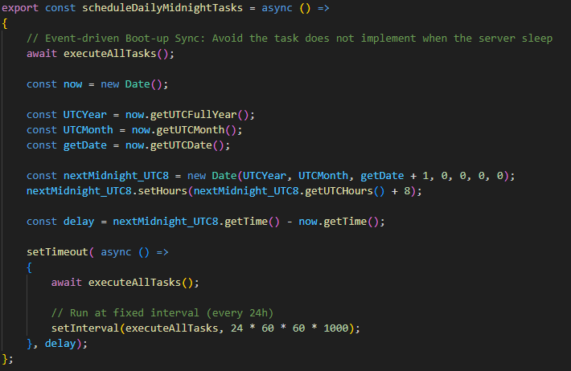
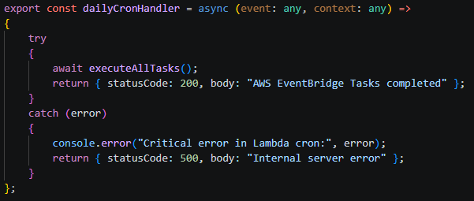

## Automated Logic
These automated backend functions run silently in the background and are difficult to showcase in a live demo. Instead, we present annotated source code images and accompanying logic descriptions to clearly explain their purpose and behavior 

**Remarks**
- The following function located in "backend/src/detectRecord.ts"

***1. Detect Record Functions*** 
### TasksList
 

- **Decoupled Task Management**
    - Implemented a Centralised Task Registry using a functional approach
    - This Separation of Concerns ensures that adding new business rules (e.g., auto-notifications) requires zero modification to the core scheduling engine, enhancing system maintainability and extensibility

### Task execution
 
To ensure high availability and data integrity, the system implements a Fault-Tolerant Execution Strategy:

- **High-Throughput Execution**
    - All tasks are mapped and executed concurrently, maximising server throughput and ensuring the Boot-up Sync completes rapidly upon container wake-up

- **Fault Isolation**
    - Utilised Promise.allSettled to ensure that independent tasks (e.g. suspension checks) continue to execute without interruption, even if one specific task (e.g. fine calculation) fails

- **Runtime Safeguards & Observability**
    - **Granular Error Tracking**
        - Each task's outcome is individually inspected (failures are captured with their specific index and reason to facilitate rapid debugging and auditability)
  
    - **Panic Prevention**
        - A global try-catch wrapper acts as a final safety net, preventing unexpected asynchronous exceptions from crashing the Node.js runtime and ensuring service continuity

### Scheduling Logic - Local
 
To ensure consistent daily execution within a distributed cloud environment:

- **Precision Scheduling Strategy**
    - **Initial Alignment**
        - setTimeout calculates the exact delay until the next target time (e.g., Midnight UTC+8) 
          (Ensure the first run aligns perfectly with business hours) 
          
    - **Drift Prevention**
        - Unlike a standalone setInterval, this dual-timer design prevents cumulative "Time Drift" (Ensure predictable reset behaviour over long-term operation) 
        
    - **Timezone Integrity**
        - Custom UTC+8 logic is implemented to overcome the lack of native timezone-specific scheduling in Node.js (Ensure synchronisation with Hong Kong business hours)
        
- **Event-driven Boot-up Sync**
    - **PaaS Resilience**
        - Specifically engineered to counter the "sleep cycles" of PaaS providers (e.g. Railway)
      
    - **Immediate Reconciliation**
        - By triggering a synchronisation check upon server wake-up, the system ensures critical business logic is never missed and is processed immediately upon boot (Even if the server was "asleep" during the scheduled midnight slot)

### Scheduling Logic - AWS (EventBridge)
 
To ensure consistent daily execution within a distributed cloud environment:

- **Serverless Scheduling Strategy**
    - **Precision via EventBridge**
        - Leveraging AWS native EventBridge for exact-time invocation (no manual drift calculation needed)

    - **Stateless Execution**
        - Each task run is a fresh, isolated invocation (Ensure zero cumulative time drift over months of operation)

    - **Timezone Consistency** 
        - Scheduling managed at the AWS Infrastructure level using UTC-based cron cron(0 16 * * ? *) to target Hong Kong Midnight

### Tasks
***1. Set Date Format to Midnight*** 
 

A core utility function specifically designed for **Loan Book Record Detection**

- **Description**
    - It normalises date comparisons in loan expiration tasks 
      (This ensures the fine calculation only considers date changes, ignoring specific hour/minute offsets) 

- **Business Logic**
    - **User-Friendly Billing**
        - Borrowers are not penalised for the specific time of day they borrowed or returned a book 
          (Expiration is triggered only when the calendar date advances (crossing midnight)) 
      
    - **Consistency**
        - Eliminates calculation discrepancies caused by the server's execution time 
          (Ensure the tasks run at 01:00 AM or 11:00 PM yield the same result) 

- **Example Scenario**
    - **Due Date**: `2025-12-24 18:30:00` → Normalised to `2025-12-24 00:00:00`
    - **Current Date**: `2025-12-25 08:15:00` → Normalised to `2025-12-25 00:00:00`
    - **Result**: The difference is exactly **1 day**, correctly triggering the first-day fine

***2. Detect Expired Loan Book Records*** (Ref: backend/src/schema/book/bookloaned.ts, Line 159–196) 
 

This background task automatically scans and identifies overdue books, initialising the fine process for delinquent accounts:

- **Efficient Fetching**
    - Queries loan records with "Loaned" status, leveraging DB-level filters ($lt, $ne) to minimise memory overhead
    
- **Date Normalisation**
    - Utilizes setToMidnight() for normalized date comparisons 
      (This ensures expiration is triggered strictly by calendar day changes (crossing midnight), ignoring specific hour/minute offsets) 
    
- **Fine Initialisation**
    - Sets finesPaid status to "Not Paid"
    - Applies an initial flat fineAmount of $1.5
    
- **Audit Logging**
    - Generates console logs for each successful modification, facilitating system monitoring and troubleshooting

***3. Dynamic Fine Scaling & Adjustment*** (Ref: backend/src/schema/book/bookloaned.ts, Line 198–232) 
 

A robust background service designed for recurring calculation and dynamic scaling of overdue fines for "Not Paid" loan records

- **Precision Date Alignment (Temporal Consistency)**
    - Utilises a custom setToMidnight() utility to strip time-specific noise (HH:mm:ss), enabling strict Calendar-Date-only comparison 
      (This ensures fine increments are triggered precisely at the transition of each new day (00:00:00), eliminating discrepancies caused by the original checkout timestamp)

- **High-Concurrency Performance Optimisation**
    - **Atomic State Validation**
        - Implements a pre-update state check (fineAmount !== finalAmount) to bypass redundant database writes 
          (This optimization reduces database I/O overhead by over 95%, only executing updates during actual daily amount transitions)
    - **Asynchronous Parallelism**
        - Replaced traditional synchronous loops with Promise.allSettled to achieve concurrent database updates 
          (This significantly increases system throughput, ensuring rapid batch processing even under heavy loan record volumes)
          
**Resilient Data Workflow & Error Handling**
    - **Clean Data Transformation**
        - Leverages flatMap to filter and transform record streams in a single pass, proactively pruning null or invalid data from the asynchronous pipeline to prevent runtime exception
    - **Granular Failure Tracking**
        - Utilises allSettled results to implement non-blocking error logging 
          (This ensures the failure of a single update does not jeopardize the entire batch, maintaining High Availability (HA) of the service)
          
- **Financial Safeguards (Business Logic Integrity)**
    - **Debt Capping**
        - Enforces a maximum threshold of $130 (via Math.min) to prevent runaway debt accumulation
    - **Anomaly Protection**
        - Incorporates Math.max(0, ...) as a safety guard to prevent illogical negative-day calculations in edge-case data scenarios

***4. Automatically Unsuspend User*** (Ref: backend/schema/user/suspendlist.ts, Line 99–137)  
 
This background task manages the automatic restoration of user accounts once their suspension period concludes

- **Expiration Monitoring**
    - Continuously monitors the SuspendList for records where the dueDate has passed ($lt: currentDate) and the status is still marked as "Suspend"
  
- **Status Synchronisation**: Performs a dual-update process to ensure data consistency:
    - **User Record**
        - Reverts the user's status from "Suspended" back to "Normal"
    - **Suspension Log**
        - Marks the specific suspension entry as "Unsuspend" and timestamps the exact unSuspendDate
    
- **Sequential Reliability**
    - Utilises a fail-safe check where the suspension log is only updated if the primary User Status modification is successful 
      (Prevent "ghost" unsuspensions) 
  
- **Audit Trail**
    - Generates a success log for each restored user 
      (Provide a clear record of automated administrative actions) 