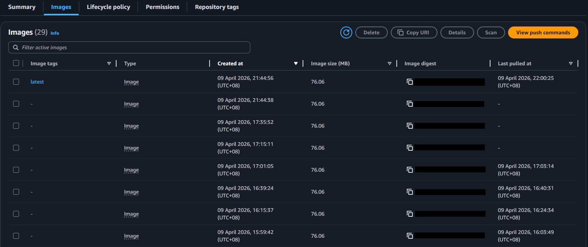
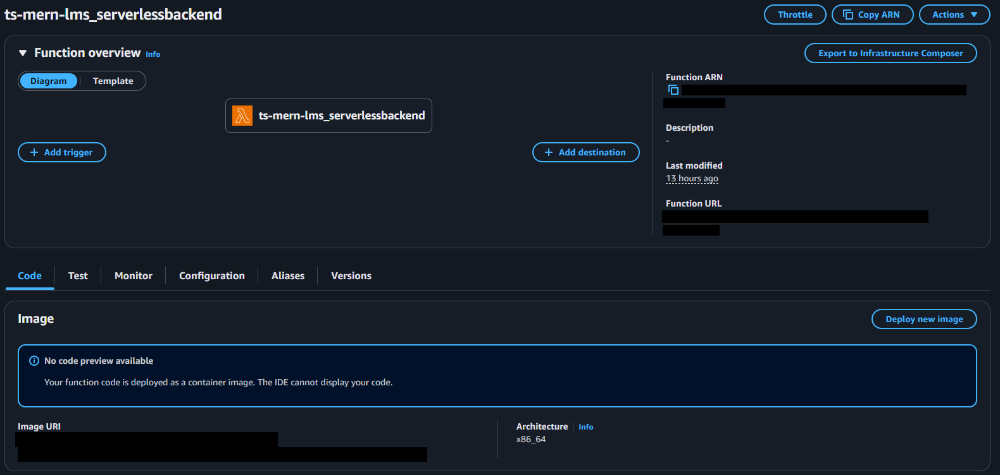

## CI/CD

### Continuous Integration (CI)
- Implemented GitHub Actions workflows triggered on every Push/PR to enforce CI/CD

- **Quality Assurance**
    - **Frontend**: Unit tests with Jest to validate UI logic
    - **Backend**: Integration tests to verify API request‑response cycles and DB interactions

- **Linting**
    - Enforced code consistency across the stack with ESLint

- **Artefact Management**
    - Generated backend coverage reports as CI artefacts for reviewer visibility
    - Built backend Docker images and pushed to Amazon ECR
    - Captured image digest as CI output, ensuring deployments reference immutable artefacts instead of latest tags

- **Docker Integration**
    - Automated multi‑stage Docker builds to guarantee reproducibility across environments

### Continuous Deployment (CD)
- **Multi-Platform Deployment Strategy**
    - **Frontend (Vercel)**
        - Integrated Deploy Hooks via GitHub Actions to replace default auto‑update
        - Optimised builds with Ignored Build Step so frontend updates only after backend readiness 
        
    - **Backend (AWS ECR + S3 Bucket + Lambda)**
        - Automated deployment pipeline updates Lambda functions using CI‑generated image digests 
          (Guaranteeing synchronised production with tested artefacts)
        - Engineered production‑ready Dockerfile for consistent runtime across local and AWS Serverless environments
        - Leveraged Lambda’s event‑driven architecture to eliminate idle server costs 
          (Adopting a cost‑effective pay‑as‑you‑go model)
        
    - **Database (MongoDB Atlas)**
        - **DBaaS Integration**
            - Direct Lambda integration with MongoDB Atlas for structured data (books, loans, users)
            - Amazon S3 used for book image storage and static assets 
              (Delivered securely via presigned URLs)

- **Deployment Status and Records**
    - **Images** 
     
    Image 1 - Vercel Deployment Record 

     
    Image 2 - AWS Deployment Record(ECR) 
    
     
    Image 3 - AWS Deployment Record(Lambda) 

    - **Deployment Secret Explanation**

    | Secret Name              | Description / Purpose                                     | How to Obtain                                                  |
    | ------------------------ | --------------------------------------------------------- | -------------------------------------------------------------- |
    | VERCEL_DEPLOY_HOOK       | Triggers automated deployment for the Frontend on Vercel  | Vercel Project Settings → Git → Deploy Hooks                   |    
    | AWS_ACCESS_KEY_ID        | IAM user identifier for GitHub Actions                    | AWS Console → IAM → Users → Security creds                     |
    | AWS_SECRET_ACCESS_KEY    | Private key paired with Access Key ID                     | AWS Console → IAM → Users → Create Access Key (shown once)     |
    | AWS_REGION               | Target region for AWS resources (e.g. ap-east-1)          | AWS Console → Region selector (top bar)                        |
    | AWS_LAMBDA_FUNCTION_NAME | Target Lambda function for CD updates                     | AWS Console → Lambda → Functions                               |

    - **Security And Operational Excellence**
        - **Zero-Credential Exposure**
            - Ensure the source code does not have private data, and fulfil the OWASP standard
        - **Automated Lifecycle**
            - Reduce the deployment mistakes on manual trigger with GitHub Actions

            
- **Changes**
    - **Production Environment Realignment**
        - Migrated BACKEND_BASE_URL and BASE_URL from localhost to production endpoints (Vercel / AWS API Gateway) 
          (Ensured seamless communication between decoupled frontend and backend services in a live cloud environment)
          
    - **Security & CORS Optimisation**
        - Enhanced ORIGINAL_URI configuration to support multiple origins 
          (Allowed backend to securely accept requests from both Vercel production domain and local development environments, improving workflow flexibility without compromising security)

    - Immutable Artefact Deployment
        - CI pipeline builds and pushes Docker images to AWS ECR, capturing image digest as output 
          (Ensures CD stage updates Lambda using tested artefacts instead of latest tags, guaranteeing reproducibility and reducing regression risk)

### Remarks
- **For CI/CD**
    - The entire CI/CD workflow is managed and automated via GitHub Actions workflows
    - CI/CD workflow definitions are located in `.github/workflows/` 
      (The whole process could be viewed in the actions tab -> All workflows, CD workflow = CD pipeline)

- **For CD (AWS Deployment)**
    - **Production Environment Realignment**
        - Migrated backend hosting from Railway to AWS Lambda (Container Image via ECR)
        - Transitioned `BACKEND_BASE_URL` to the Amazon API Gateway endpoint 
          (This ensures the frontend communicates with a scalable, production-grade REST API instead of a fixed-server environment)

    - **Cost & Infrastructure Management**
        - Utilising AWS Free Tier / Pay-as-you-go model for Lambda and ECR 
          (Provide highly cost-effective scaling compared to fixed subscription models)